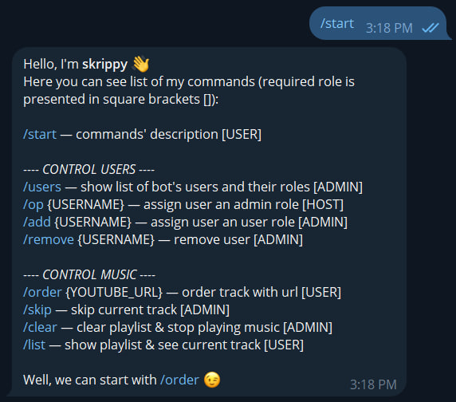
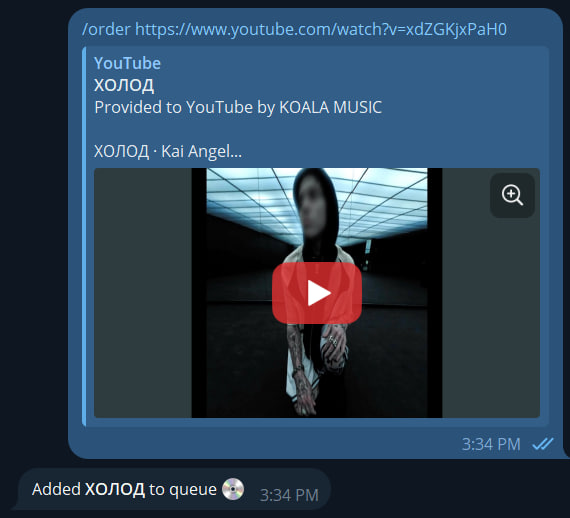

<h1 align="center">Skrip 💿</h1>

> <p align="center">Telegram-bot for ordering music (with Youtube URL) at parties using VLC media player HTTP interface</p>

## 👻 Preview




## 👾 Installation (create your own bot)

### 💍 Dependencies

Make sure you have installed and added to $PATH

- FFMPEG (https://www.ffmpeg.org/download.html)
- NodeJS (https://nodejs.org/en/download/package-manager)
- VLC Media Player (https://www.videolan.org/vlc/)
- Git (optionally, https://git-scm.com/downloads)

Pay attention to configure VLC Media Player to use it's HTTP interface (guide: https://hobbyistsoftware.com/vlcsetup-win-manual-2)

### 🤞 Cloning application

You can download source code in .zip using GitHub <b>OR</b> type in your terminal

```shell
cd directory-you-want
git clone https://github.com/koniziwa/skrip.git
```

### 🌪️ Getting packages

Use your favorite package manager (my love is yarn) to install packages

```shell
cd skrip
yarn || npm install
```

### 🌵 Register new bot

Contact [@BotFather](https://t.me/BotFather) in telegram to register your bot and get API token (I believe it will be very easy because BotFather gives you simple instructions each step)

### ☄️ Configure & Build application

Use custom scripts to configure application (run commands while in /skrip folder)

```shell
yarn || npm run setup
```

answer a few questions, then you can

```shell
yarn || npm run build
```

## 💥 Start bot

To start polling, run

```shell
yarn || npm run start
```

So, it is all you need to get working bot

P.S.: If you want to clear application cache (includes your music library), run

```shell
yarn || npm run clear
```

## 👑 Congratulations

Now, I hope, you have successfully installed <b>Skrip</b> on your device!

If you have something to say about this project — contact me [@koniziwa](https://t.me/koniziwa) 🍇
